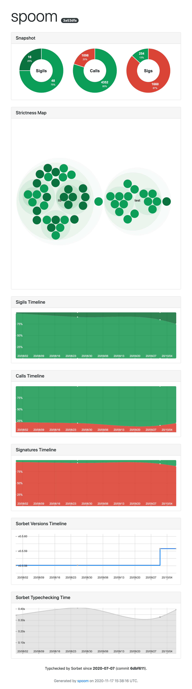

# Spoom

Useful tools for Sorbet enthusiasts.

## Installation

Add this line to your application's Gemfile:

```ruby
gem 'spoom'
```

And then execute:

    $ bundle

Or install it yourself as:

    $ gem install spoom

## Usage

`spoom` provides both a CLI and an API to interact with Sorbet.

### Generate a typing coverage report

Spoom can create a typing coverage report from Sorbet and Git data:



After installing the `spoom` gem, run the `timeline` command to collect the history data:

```
$ spoom coverage timeline --save
```

Then create the HTML page with `report`:

```
$ spoom coverage report
```

Your report will be generated under `spoom_report.html`.

See all the [Typing Coverage](#typing-coverage) CLI commands for more details.

### Command Line Interface

#### Sorbet configuration commands

Spoom works with your `sorbet/config` file. No additional configuration is needed.

Show Sorbet config options:

```
$ spoom config
```

#### Listing files

List the files (and related strictness) that will be typchecked with the current Sorbet config options:

```
$ spoom files
```

#### Errors sorting and filtering

List all typechecking errors sorted by location:

```
$ spoom tc -s loc
```

List all typechecking errors sorted by error code first:

```
$ spoom tc -s code
```

List only typechecking errors from a specific error code:

```
$ spoom tc -c 7004
```

List only the first 10 typechecking errors

```
$ spoom tc -l 10
```

These options can be combined:

```
$ spoom tc -s -c 7004 -l 10
```

Remove duplicated error lines:

```
$ spoom tc -u
```

Format each error line:

```
$ spoom tc -f '%C - %F:%L: %M'
```

Where:

* `%C` is the error code
* `%F` is the file the error is from
* `%L` is the line the error is from
* `%M` is the error message

Hide the `Errors: X` at the end of the list:

```
$ spoom tc --no-count
```

List only the errors comming from specific directories or files:

```
$ spoom tc file1.rb path1/ path2/
```

#### Typing coverage

Show metrics about the project contents and the typing coverage:

```
$ spoom coverage
```

Save coverage data under `spoom_data/`:

```
$ spoom coverage --save
```

Save coverage data under a specific directory:

```
$ spoom coverage --save my_data/
```

Show typing coverage evolution based on the commits history:

```
$ spoom coverage timeline
```

Show typing coverage evolution based on the commits history between specific dates:

```
$ spoom coverage timeline --from YYYY-MM-DD --to YYYY-MM-DD
```

Save the typing coverage evolution as JSON under `spoom_data/`:

```
$ spoom coverage timeline --save
```

Save the typing coverage evolution as JSON in a specific directory:

```
$ spoom coverage timeline --save my_data/
```

Run `bundle install` for each commit of the timeline (may solve errors due to different Sorbet versions):

```
$ spoom coverage timeline --bundle-install
```

Generate an HTML typing coverage report:

```
$ spoom coverage report
```

Change the colors used for strictnesses (useful for colorblind folks):

```
$ spoom coverage report \
  --color-true "#648ffe" \
  --color-false "#fe6002" \
  --color-ignore "#feb000" \
  --color-strict "#795ef0" \
  --color-strong "#6444f1"
```

Open the HTML typing coverage report:

```
$ spoom coverage open
```

#### Change the sigil used in files

Bump the strictness from all files currently at `typed: false` to `typed: true` where it does not create typechecking errors:

```
$ spoom bump --from false --to true
```

Bump the strictness from all files currently at `typed: false` to `typed: true` even if it creates typechecking errors:

```
$ spoom bump --from false --to true -f
```

Bump the strictness from a list of files (one file by line):

```
$ spoom bump --from false --to true -o list.txt
```

Check if files can be bumped without applying any change:

```
$ spoom bump --from false --to true --dry
```

Bump files using a custom instance of Sorbet:

```
$ spoom bump --from false --to true --sorbet /path/to/sorbet/bin
```

Count the number of type-checking errors if all files were bumped to true:

```
$ spoom bump --count-errors --dry
```

#### Interact with Sorbet LSP mode

**Experimental**

Find all definitions for `Foo`:

```
$ spoom lsp find Foo
```

List all symbols in a file:

```
$ spoom lsp symbols <file.rb>
```

List all definitions for a specific code location:

```
$ spoom lsp defs <file.rb> <line> <column>
```

List all references for a specific code location:

```
$ spoom lsp refs <file.rb> <line> <column>
```

Show hover information for a specific code location:

```
$ spoom lsp hover <file.rb> <line> <column>
```

Show signature information for a specific code location:

```
$ spoom lsp sig <file.rb> <line> <column>
```

Show type information for a specific code location:

```
$ spoom lsp sig <file.rb> <line> <column>
```

### API

#### Parsing Sorbet config

Parses a Sorbet config file:

```ruby
config = Spoom::Sorbet::Config.parse_file("sorbet/config")
puts config.paths   # "."
```

Parses a Sorbet config string:

```ruby
config = Spoom::Sorbet::Config.parse_string(<<~CONFIG)
  a
  --file=b
  --ignore=c
CONFIG
puts config.paths   # "a", "b"
puts config.ignore  # "c"
```

List all files typchecked by Sorbet:

```ruby
config = Spoom::Sorbet::Config.parse_file("sorbet/config")
puts Spoom::Sorbet.srb_files(config)
```

#### Parsing Sorbet metrics

Display metrics collected during typechecking:

```ruby
puts Spoom::Sorbet.srb_metrics(capture_err: false)
```

#### Interacting with LSP

Create an LSP client:

```rb
client = Spoom::LSP::Client.new(
  Spoom::Sorbet::BIN_PATH,
  "--lsp",
  "--enable-all-experimental-lsp-features",
  "--disable-watchman",
)
client.open(".")
```

Find all the symbols matching a string:

```rb
puts client.symbols("Foo")
```

Find all the symbols for a file:

```rb
puts client.document_symbols("file://path/to/my/file.rb")
```

## Development

After checking out the repo, run `bin/setup` to install dependencies. Then, run `bin/test` to run the tests. You can also run `bin/console` for an interactive prompt that will allow you to experiment. Don't forget to run `bin/sanity` before pushing your changes.

To install this gem onto your local machine, run `bundle exec rake install`. To release a new version, update the version number in `version.rb`, and then run `bundle exec rake release`, which will create a git tag for the version, push git commits and tags, and push the `.gem` file to [rubygems.org](https://rubygems.org).

## Contributing

Bug reports and pull requests are welcome on GitHub at https://github.com/Shopify/spoom. This project is intended to be a safe, welcoming space for collaboration, and contributors are expected to adhere to the [Contributor Covenant](http://contributor-covenant.org) code of conduct.

## License

The gem is available as open source under the terms of the [MIT License](https://opensource.org/licenses/MIT).

## Code of Conduct

Everyone interacting in the Spoom project’s codebases, issue trackers, chat rooms and mailing lists is expected to follow the [code of conduct](https://github.com/Shopify/spoom/blob/main/CODE_OF_CONDUCT.md).
