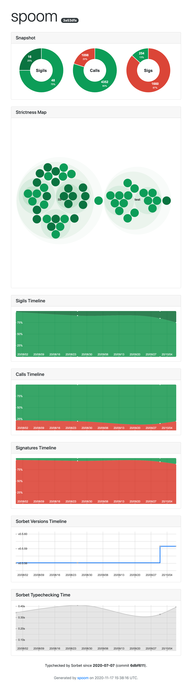

# Spoom

Useful tools for Sorbet projects.

Spoom provides a CLI and a Ruby API to inspect Sorbet projects, improve typing coverage, translate signatures, query Sorbet LSP, and find dead code.

## Installation

Add Spoom to your application's Gemfile:

```ruby
gem "spoom"
```

Then install it:

```sh
bundle install
```

Or install it directly:

```sh
gem install spoom
```

Spoom requires Ruby 3.3 or newer.

## Command line interface

Run `spoom help` or `spoom help COMMAND` to list all available commands.

### Typechecking errors

`spoom srb tc` runs `srb tc` and can sort, filter, format, and export errors.

List errors sorted by location:

```sh
spoom srb tc --sort loc
```

List errors sorted by error code:

```sh
spoom srb tc --sort code
```

List only errors with a specific code:

```sh
spoom srb tc --code 7004
```

Limit the number of displayed errors:

```sh
spoom srb tc --limit 10
```

Options can be combined:

```sh
spoom srb tc --sort code --code 7004 --limit 10
```

Remove duplicated error lines:

```sh
spoom srb tc --uniq
```

Format each error line:

```sh
spoom srb tc --format "%C - %F:%L: %M"
```

Format tokens:

* `%C`: error code
* `%F`: file path
* `%L`: line number
* `%M`: error message

Hide the final `Errors: X` count:

```sh
spoom srb tc --no-count
```

List only errors from specific files or directories:

```sh
spoom srb tc file1.rb path1/ path2/
```

Write errors to a JUnit XML file:

```sh
spoom srb tc --junit-output-path junit.xml
```

Pass extra options to Sorbet:

```sh
spoom srb tc --sorbet-options="--typed=true"
```

### Typing coverage

`spoom srb coverage` collects Sorbet coverage metrics and can generate an HTML report from Sorbet and Git data.



Show a coverage snapshot:

```sh
spoom srb coverage
```

Save a snapshot under `spoom_data/`:

```sh
spoom srb coverage --save
```

Save a snapshot under a specific directory:

```sh
spoom srb coverage --save my_data/
```

Show typing coverage evolution based on Git history:

```sh
spoom srb coverage timeline
```

Replay a specific date range:

```sh
spoom srb coverage timeline --from YYYY-MM-DD --to YYYY-MM-DD
```

Save timeline snapshots under `spoom_data/`:

```sh
spoom srb coverage timeline --save
```

Save timeline snapshots under a specific directory:

```sh
spoom srb coverage timeline --save my_data/
```

Run `bundle install` before collecting each timeline snapshot:

```sh
spoom srb coverage timeline --bundle-install
```

Generate an HTML coverage report from saved snapshots:

```sh
spoom srb coverage report
```

The report is generated at `spoom_report.html` by default.

Generate a report from a custom data directory:

```sh
spoom srb coverage report --data my_data/
```

Change the generated report path:

```sh
spoom srb coverage report --file coverage.html
```

Change report colors:

```sh
spoom srb coverage report \
  --color-true "#648ffe" \
  --color-false "#fe6002" \
  --color-ignore "#feb000" \
  --color-strict "#795ef0" \
  --color-strong "#6444f1"
```

Open the HTML coverage report:

```sh
spoom srb coverage open
```

Open a report at a custom path:

```sh
spoom srb coverage open coverage.html
```

### Sorbet sigils

`spoom srb bump` changes `# typed:` sigils when the change does not introduce typechecking errors.

Bump files from `typed: false` to `typed: true`:

```sh
spoom srb bump --from false --to true
```

Force the change without typechecking:

```sh
spoom srb bump --from false --to true --force
```

Bump only files listed in a file, one path per line:

```sh
spoom srb bump --from false --to true --only list.txt
```

Check which files can be bumped without applying changes:

```sh
spoom srb bump --from false --to true --dry
```

This command exits with a non-zero status when files can be bumped, which is useful in CI.

Use a custom Sorbet executable:

```sh
spoom srb bump --from false --to true --sorbet /path/to/sorbet/bin
```

Count typechecking errors if all files were bumped:

```sh
spoom srb bump --from false --to true --count-errors --dry
```

### Signatures and type assertions

`spoom srb sigs` translates signatures between Sorbet RBI syntax and RBS comments.

Translate signatures from RBI to RBS comments:

```sh
spoom srb sigs translate
```

Translate signatures from RBS comments to RBI:

```sh
spoom srb sigs translate --from rbs --to rbi path/to/file.rb
```

Strip Sorbet signatures from files:

```sh
spoom srb sigs strip path/to/file.rb
```

Export gem signatures to an RBI file:

```sh
spoom srb sigs export
```

Check that the exported RBI file is up to date:

```sh
spoom srb sigs export --check-sync
```

`spoom srb assertions` translates Sorbet type assertions to RBS comments:

```sh
spoom srb assertions translate path/to/file.rb
```

### Sorbet LSP

`spoom srb lsp` sends requests to Sorbet LSP.

This command group is experimental.

Find symbols matching `Foo`:

```sh
spoom srb lsp find Foo
```

List symbols in a file:

```sh
spoom srb lsp symbols file.rb
```

List definitions for a code location:

```sh
spoom srb lsp defs file.rb 10 4
```

List references for a code location:

```sh
spoom srb lsp refs file.rb 10 4
```

Show hover information for a code location:

```sh
spoom srb lsp hover file.rb 10 4
```

Show signature information for a code location:

```sh
spoom srb lsp sigs file.rb 10 4
```

Show type information for a code location:

```sh
spoom srb lsp types file.rb 10 4
```

### Sorbet code metrics

`spoom srb metrics` collects metrics about Sorbet usage in Ruby files.

Show metrics for the current project:

```sh
spoom srb metrics
```

Show metrics for specific files or directories:

```sh
spoom srb metrics lib/ test/foo_test.rb
```

Dump raw metric keys and values:

```sh
spoom srb metrics --dump
```

### Dead code

`spoom deadcode` indexes a project and reports definitions that do not appear to be referenced.

Analyze the current project:

```sh
spoom deadcode
```

Analyze specific paths:

```sh
spoom deadcode lib/ app/models/
```

Show files, loaded plugins, definitions, or references used during analysis:

```sh
spoom deadcode --show-files
spoom deadcode --show-plugins
spoom deadcode --show-defs
spoom deadcode --show-refs
```

Remove a reported dead code candidate:

```sh
spoom deadcode remove path/to/file.rb:42:18-47:23
```

## Ruby API

### Parsing Sorbet config

Parse a Sorbet config file:

```ruby
config = Spoom::Sorbet::Config.parse_file("sorbet/config")
puts config.paths
```

Parse a Sorbet config string:

```ruby
config = Spoom::Sorbet::Config.parse_string(<<~CONFIG)
  a
  --file=b
  --ignore=c
CONFIG

puts config.paths
puts config.ignore
```

List all files typechecked by Sorbet:

```ruby
config = Spoom::Sorbet::Config.parse_file("sorbet/config")
puts Spoom::Sorbet.srb_files(config)
```

### Parsing Sorbet metrics

Display metrics collected during typechecking:

```ruby
puts Spoom::Sorbet.srb_metrics(capture_err: false)
```

### Interacting with LSP

Create an LSP client:

```ruby
client = Spoom::LSP::Client.new(
  Spoom::Sorbet::BIN_PATH,
  "--lsp",
  "--enable-all-experimental-lsp-features",
  "--disable-watchman",
)
client.open(".")
```

Find symbols matching a string:

```ruby
puts client.symbols("Foo")
```

Find symbols in a file:

```ruby
puts client.document_symbols("file://path/to/my/file.rb")
```

## Backtrace filtering

Spoom provides a Minitest backtrace filter that removes Sorbet frames from test failures.

Enable it in your test helper:

```ruby
# test/test_helper.rb
require "spoom/backtrace_filter/minitest"

Minitest.backtrace_filter = Spoom::BacktraceFilter::Minitest.new
```

## Development

After checking out the repo, install dependencies:

```sh
bin/setup
```

Run the tests:

```sh
bin/test
```

Run an interactive console:

```sh
bin/console
```

Run the full local sanity check before pushing:

```sh
bin/sanity
```

Install this gem locally:

```sh
bundle exec rake install
```

## Releasing

### Bump the gem version

* [ ] Update the version number in [`lib/spoom/version.rb`](https://github.com/Shopify/spoom/blob/main/lib/spoom/version.rb)
* [ ] Run `bundle install` to update the version number in `Gemfile.lock`
* [ ] Commit the change with `Bump version to vx.y.z`
* [ ] Push the change directly to `main` or open a pull request

### Create a new tag

* [ ] Create a tag with the new version number: `git tag vx.y.z`
* [ ] Push the tag: `git push origin vx.y.z`

### Publish the release

The [release workflow](https://github.com/Shopify/spoom/actions/workflows/release.yml) publishes new gem versions to RubyGems through [Trusted Publishing](https://guides.rubygems.org/trusted-publishing/).

A member of the Ruby and Rails Infrastructure team at Shopify must approve the workflow before it runs. Once approved, it publishes the gem and creates a GitHub release.

## Contributing

Bug reports and pull requests are welcome on GitHub at https://github.com/Shopify/spoom.

This project is intended to be a safe, welcoming space for collaboration. Contributors are expected to follow the [Contributor Covenant](http://contributor-covenant.org) code of conduct.

## License

The gem is available as open source under the terms of the [MIT License](https://opensource.org/licenses/MIT).

## Code of Conduct

Everyone interacting in Spoom's codebases, issue trackers, chat rooms, and mailing lists is expected to follow the [code of conduct](https://github.com/Shopify/spoom/blob/main/CODE_OF_CONDUCT.md).
